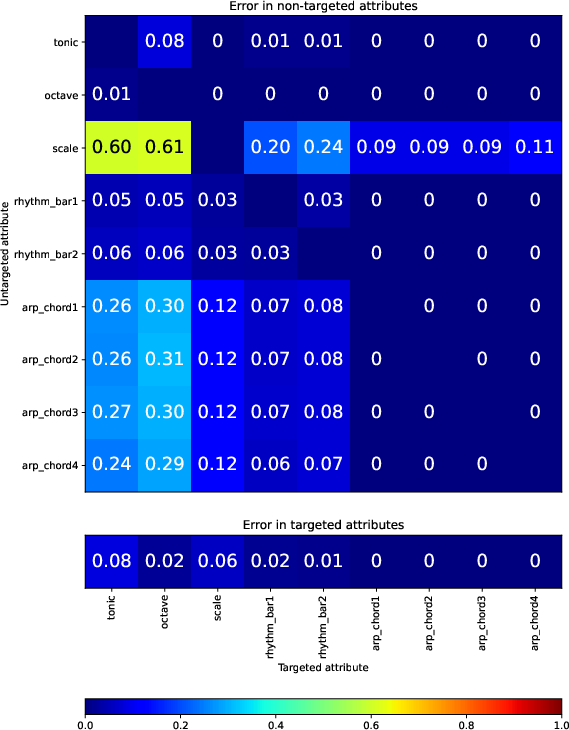

## Results

Here are some additional results that could not be included in the paper due to space constraints.

### Error in Target and Non-target attributes

This figure shows the target error (bottom) and non-target error (top) for each target attribute (horizontal axis). Lower errors are better.

The paper shows an aggregate over random seeds of the best and worst performing models.

See also:

* [Raw target error for all models, 36 plots](v1e/target.pdf)
* [Target error for all models aggregated over random seeds, 12 plots](v1e/target-merge.pdf)

### Correlation between target and result attributes

This figure shows the correlation between the intended attribute value (horizontal axis) and the achieved attribute value (vertical axis).

See also:

* [Correlation for rhythm-bar1 for all models, 36 plots](v1e/rhythm-bar1.pdf)
* [Correlation for rhythm-bar1 for all models aggregated over random seeds, 12 plots](v1e/rhythm-bar1-merge.pdf)
* [Correlation for rhythm-bar2 for all models, 36 plots](v1e/rhythm-bar2.pdf)
* [Correlation for rhythm-bar2 for all models aggregated over random seeds, 12 plots](v1e/rhythm-bar2-merge.pdf)

### Visualisation of the VAE latent embedding

This figure shows the structure of the latent space. We plot the location of 5000 sample points coloured according to their feature class. For each of the first 9 latent dimensions, we plot the location on this dimension versus location the other 8 dimensions. For all the regularised models the first 9 dimensions correspond to the semantic attributes.

Example images are for S2-VAE (left) and Beta-VAE (right)

See also:

* [Latent embedding for dimension 1 (tonic), 36 plots](v1e/spaceplot-1.pdf)
* [Latent embedding for dimension 2 (octave), 36 plots](v1e/spaceplot-2.pdf)
* [Latent embedding for dimension 3 (scale), 36 plots](v1e/spaceplot-3.pdf)
* [Latent embedding for dimension 4 (rhythm-bar1), 36 plots](v1e/spaceplot-4.pdf)
* [Latent embedding for dimension 5 (rhythm-bar2), 36 plots](v1e/spaceplot-5.pdf)
* [Latent embedding for dimension 6 (arp-chord1), 36 plots](v1e/spaceplot-6.pdf)
* [Latent embedding for dimension 7 (arp-chord2), 36 plots](v1e/spaceplot-7.pdf)
* [Latent embedding for dimension 8 (arp-chord3), 36 plots](v1e/spaceplot-8.pdf)
* [Latent embedding for dimension 9 (arp-chord4), 36 plots](v1e/spaceplot-9.pdf)

### Loss During Training

This figure shows components of the overall loss as a function of training step. Loss R is for the "relevant" dimensions which should be close to the target value, Loss I is for the "irrelevant" dimensions which should be close to the original value, and Loss C is the perceptual loss, the difference between the achieved value and the target attribute value.

See also:

* [Loss During Training of SeNT traversal functions](v1e/learn.pdf)
* [Loss During Training of "Z to C" surrogate model](v1e/learnzc.pdf)

### Correlations and Target Density Ratio (TDR) for all models

The paper summarises performance by choosing the best performing hyperparameter settings for each of the four model types, and aggregating over random seeds. This data is shown in Table 2 (correlation between target and achieved attribute) and Table 3 (target density ratio TDR).

The following presents the results all model types and hyperparmaeter settings (12 settings rather than 4), still aggregated over random seeds:

* [Correlations for all 12 model settings](v1e/table-r2.csv)
* [Target Density Ratio for all 12 model settings](v1e/table-valid.csv)

